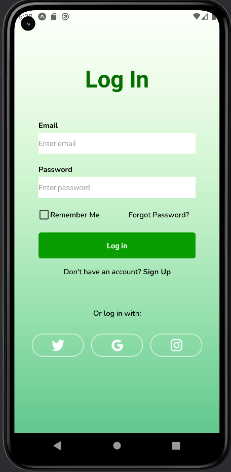
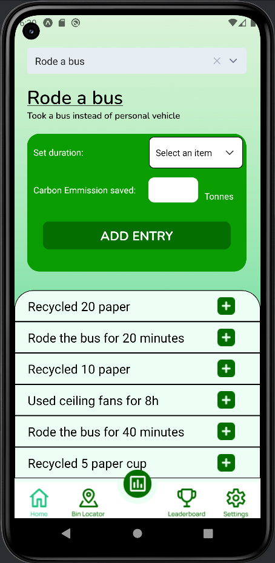
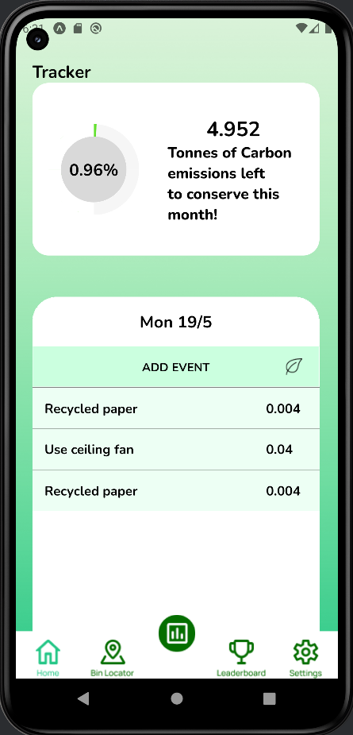
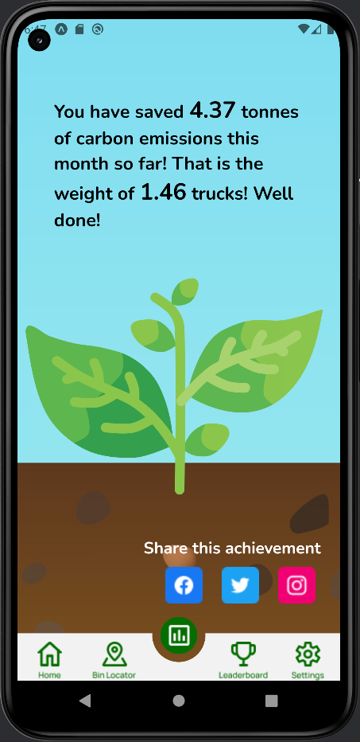
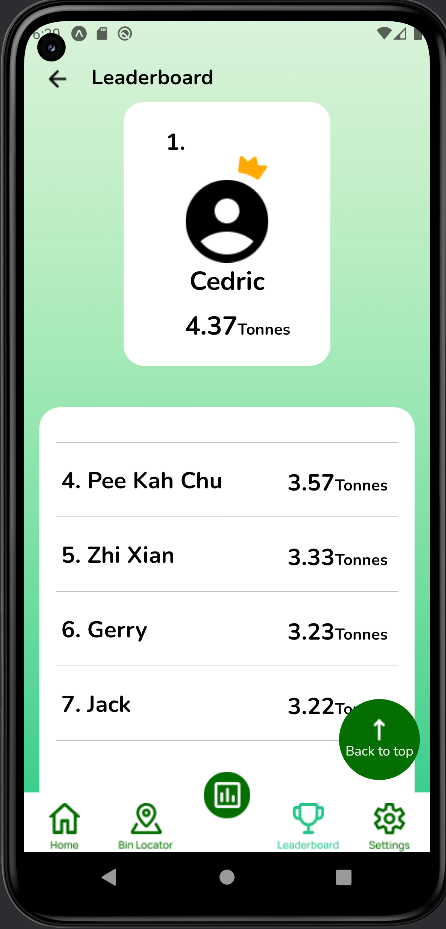
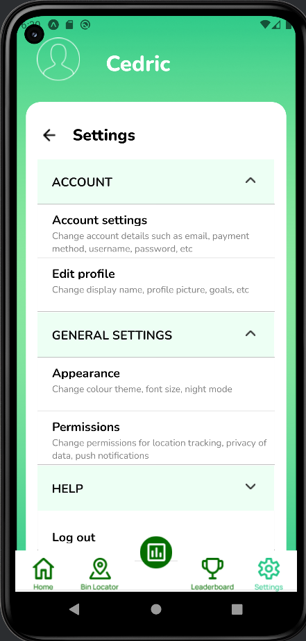

# Carbon Footprint Tracker App  
Cross-platform mobile application built with Expo & React Native to help users log eco-friendly activities, visualize their environmental impact over time, and compete on a global leaderboard.

# 🚀 Features
- 🔐 **Authentication**  
  – Sign up & login with Firebase Auth  
  – “Remember me” via AsyncStorage  
  – Secure logout

- 🌱 **Activity Tracking**  
  – Choose from a curated list of carbon-saving actions (e.g. bus rides, recycling, ceiling-fan use) or add your own custom activity
  – Specify duration or quantity to calculate CO₂ saved  
  – Persistent entries in Cloud Firestore
  

- 📊 **Progress Dashboard**  
  – Weekly / monthly summary of CO₂ saved 
  – Interactive Lottie animation feedback  
  – Capture & share your dashboard snapshot via ViewShot

- 🏆 **Leaderboard**  
  – View top savers globally  
  – Real-time updates from Firestore

- ⚙️ **Settings & FAQ**  
  – Collapsible sections for account info, app tips, and FAQs  
  – Change user details

# Instructions
Ensure that your have node.js installed in your device.
Run 'npm install expo' in the command line to install expo.
In the main directory, run 'npx expo start --tunnel' in the terminal to generate a qr code.
Ensure that your phone has the 'Expo Go' app installed from google play.
Through the Expo Go app on your phone, scan the qr code to run the application.

YOU CAN SIGN UP WITH A NEW ACCOUNT OR LOGIN WITH EMAIL: 'test@gmail.com' AND PASSWORD: '123456'.

# Disclaimer
The firebase api key has since been removed.
